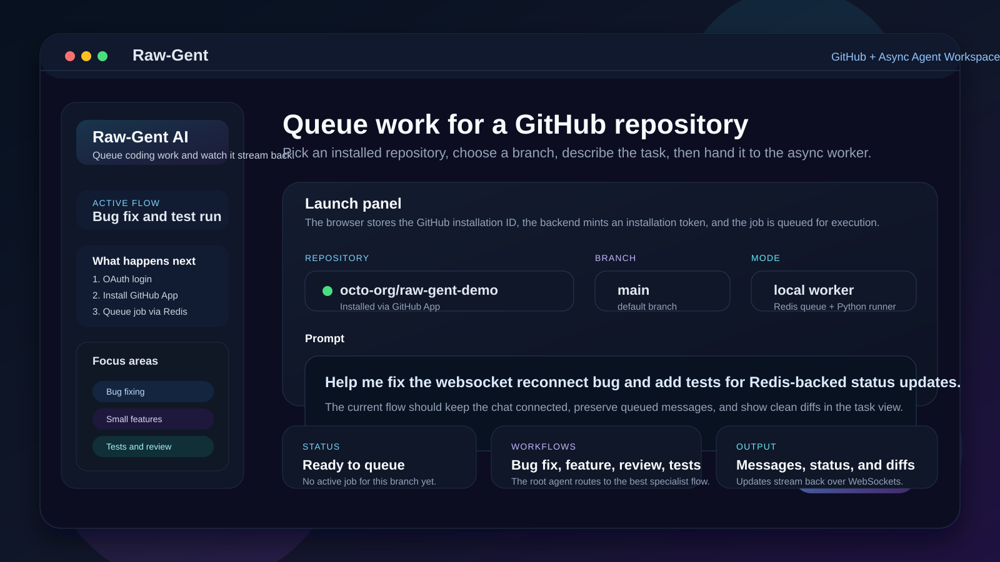
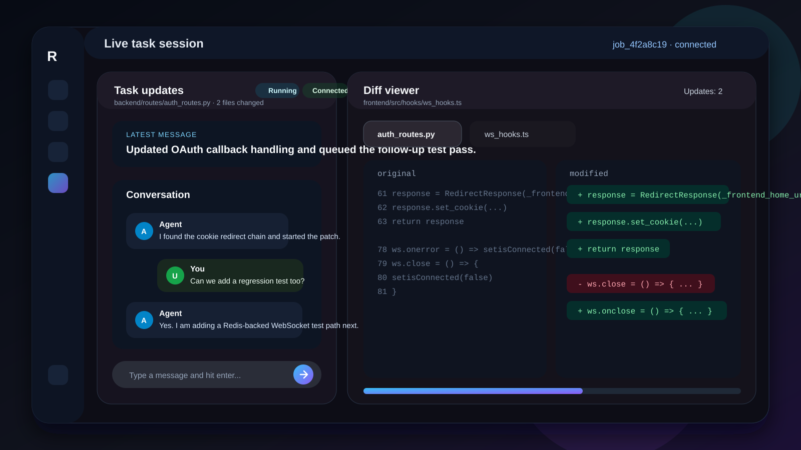
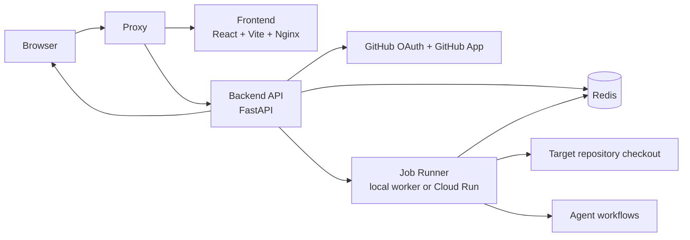

# Raw-Gent

Raw-Gent is a GitHub-connected, asynchronous coding agent for repository tasks such as bug fixes, small features, code review, and test generation. It combines a React frontend, a FastAPI backend, Redis-backed job coordination, and a Python job runner that streams live status, messages, and file diffs back to the browser over WebSockets.

The project is currently best described as an early open-source release: the core flow is in place, the deployment story is working, and the product shape is clear, but testing and production hardening are still catching up.

## Screenshots

These are lightweight repo-local SVG interface previews based on the current UI so the README renders cleanly on GitHub.

| Prepare a run | Follow execution live |
| --- | --- |
|  |  |

## What Raw-Gent Does

- Authenticates users with GitHub OAuth.
- Connects repositories through a GitHub App installation flow.
- Lets a user choose a repository, select a branch, and submit a natural-language coding task.
- Queues work through Redis and runs the task through specialized agent workflows.
- Streams live job status and agent messages to the browser over WebSockets.
- Shows file-level changes in a diff viewer while the job is running.
- Supports a local worker mode and a Cloud Run worker mode.

## Product Flow

1. A user signs in with GitHub through the backend OAuth flow.
2. The user installs or selects the GitHub App for a repository.
3. The frontend sends a run request with the prompt, repository, branch, and installation ID.
4. The backend mints a GitHub installation token, creates a job record, and either enqueues the job in Redis or triggers Cloud Run.
5. The worker clones the target repository, runs the agent workflow, and publishes status updates and agent messages back to Redis.
6. The backend relays Redis pub/sub updates to the browser over `/ws/status/{job_id}` and persists the latest status for reconnects.

## Architecture



- `frontend/`: React + Vite app for login, repository selection, branch selection, prompt submission, live task monitoring, and diff viewing.
- `backend/`: FastAPI service for GitHub auth, GitHub App integration, job creation, Redis coordination, and WebSocket fan-out.
- `job_runner/`: Python worker that pulls queued jobs, clones repositories, runs the Google ADK-based agent workflows, and publishes updates.
- `Redis`: Shared queue, pub/sub bus, and short-lived job status store.
- `proxy`: Caddy in Docker serves the app on one public origin and forwards UI, API, and WebSocket traffic to the correct service.
- `frontend` container: Nginx serves the compiled Vite build behind the proxy.

## Repository Layout

```text
.
|-- backend/      FastAPI API, GitHub auth, Redis services, WebSocket routes
|-- frontend/     React UI, runtime config, task workspace, diff viewer
|-- job_runner/   Worker process and agent workflows
|-- deploy/       Caddy configuration for local and production Docker
|-- docker-compose.yml
|-- docker-compose.prod.yml
`-- DEPLOYMENT.md
```

## Local Setup

The smoothest full-stack experience is Docker, but contributors can also run the services directly. The biggest caveat is that the backend currently targets Python 3.13 while the worker Docker image uses Python 3.11, so a pure local setup is easiest if you are comfortable managing multiple Python environments.

### Prerequisites

- Node.js 20+
- Corepack or Yarn
- Python 3.13 for `backend/`
- Python 3.11+ for `job_runner/`
- Redis 7
- A GitHub OAuth App
- A GitHub App with a PEM private key
- A model key such as `GEMINI_API_KEY`

### 1. Start Redis

If you do not already have Redis running locally, the quickest option is:

```bash
docker run --rm -p 6379:6379 redis:7-alpine redis-server --appendonly yes
```

### 2. Configure and run the backend

Create a local backend env file from the example:

```bash
cp backend/.env.example backend/.env
```

For a split-origin local dev setup, update these values in `backend/.env`:

```env
FRONTEND_URL=http://localhost:5173
BACKEND_URL=http://localhost:8000
CORS_ORIGINS=http://localhost:5173
GITHUB_CALLBACK_URL=http://localhost:8000/auth/callback
REDIS_URL=redis://localhost:6379/0
JOB_RUNNER_MODE=local
COOKIE_SECURE=false
GITHUB_PRIVATE_KEY_PATH=/absolute/path/to/your/private-key.pem
```

Also fill in:

- `GITHUB_CLIENT_ID`
- `GITHUB_CLIENT_SECRET`
- `GITHUB_APP_ID`
- `GITHUB_APP_CLIENT_ID`
- `GITHUB_APP_CLIENT_SECRET`
- `GEMINI_API_KEY`

Then install and run the backend:

```bash
cd backend
poetry install
poetry run uvicorn server:app --reload --host 0.0.0.0 --port 8000
```

### 3. Configure and run the worker

The worker reads its configuration from environment variables in the shell that starts it. At minimum, make sure these are present:

- `REDIS_URL=redis://localhost:6379/0`
- `JOB_QUEUE_NAME=agent_jobs:queue`
- `GEMINI_API_KEY=...`

Then install dependencies and start the worker. If you prefer using a virtual environment, activate it before running these commands:

```bash
cd job_runner
python -m pip install -r requirements.txt
python worker.py
```

### 4. Configure and run the frontend

Create the frontend env file:

```bash
cp frontend/.env.example frontend/.env
```

Set these values in `frontend/.env`:

```env
VITE_API_URL=http://localhost:8000
VITE_WS_URL=ws://localhost:8000
VITE_LOGIN_URL=http://localhost:8000/login
VITE_GITHUB_APP_INSTALL_URL=https://github.com/apps/<your-app>/installations/new
```

Then start the frontend:

```bash
cd frontend
corepack enable
yarn install
yarn dev --host
```

Open `http://localhost:5173`.

## Docker Quick Start

For the easiest end-to-end setup, use Docker Compose.

1. Copy the local Docker env file:

```bash
cp .env.docker.example .env
```

2. Fill in the required GitHub and model credentials.
3. Point `GITHUB_PRIVATE_KEY_HOST_FILE` at your GitHub App PEM if you do not want to use the default `./private-key.pem`.
4. Start the stack:

```bash
docker compose --env-file .env up --build
```

5. Open `http://localhost`.

For production deployment, TLS, and single-origin Docker details, see [DEPLOYMENT.md](DEPLOYMENT.md).

## Environment Variables

The repo has multiple example env files:

- `backend/.env.example`
- `frontend/.env.example`
- `.env.docker.example`
- `.env.production.example`

The most important variables are:

| Variable | Used by | Required | Purpose |
| --- | --- | --- | --- |
| `GITHUB_CLIENT_ID` | backend | Yes | GitHub OAuth login client ID |
| `GITHUB_CLIENT_SECRET` | backend | Yes | GitHub OAuth login client secret |
| `GITHUB_CALLBACK_URL` | backend | Yes | OAuth callback URL exposed by the backend |
| `GITHUB_APP_ID` | backend | Yes | GitHub App ID |
| `GITHUB_APP_CLIENT_ID` | backend | Yes | GitHub App client ID |
| `GITHUB_APP_CLIENT_SECRET` | backend | Yes | GitHub App client secret |
| `GITHUB_PRIVATE_KEY_PATH` or `GITHUB_PRIVATE_KEY` | backend | Yes | GitHub App private key source |
| `REDIS_URL` | backend, worker | Yes | Queue, pub/sub, and status store connection |
| `JOB_RUNNER_MODE` | backend | Yes | `local`, `docker`, or `cloud_run` |
| `JOB_QUEUE_NAME` | backend, worker | Yes | Redis list used for queued jobs |
| `GEMINI_API_KEY` | worker | Usually | Model key for the local worker flow |
| `GCP_PROJECT_ID` | backend | Cloud Run only | Google Cloud project for worker execution |
| `GCP_REGION` | backend | Cloud Run only | Region for the Cloud Run job |
| `CLOUD_RUN_JOB` | backend | Cloud Run only | Cloud Run job name |
| `GOOGLE_CLOUD_KEY_JSON` | backend | Optional | Inline service account JSON for Cloud Run access |
| `FRONTEND_URL` | backend | Yes | Browser-facing frontend origin |
| `BACKEND_URL` | backend | Yes | Browser-facing backend origin |
| `CORS_ORIGINS` | backend | Yes | Allowed frontend origins |
| `VITE_API_URL` | frontend | Split-origin only | API base URL for the browser |
| `VITE_WS_URL` | frontend | Split-origin only | WebSocket base URL |
| `VITE_LOGIN_URL` | frontend | Optional | Login URL override |
| `VITE_GITHUB_APP_INSTALL_URL` | frontend | Optional | GitHub App install URL override |

## Current Limitations

- GitHub is the only supported source-control integration today.
- The default live experience depends on both Redis and a healthy WebSocket connection.
- Full-stack local development is more awkward than Docker because the backend and worker currently use different Python runtimes.
- Automated backend test coverage is still light and should grow before a broader public release.
- The current worker model is optimized for repo-scoped engineering tasks, not large multi-repo orchestration.

## Deployment

- Local and production Docker deployment details: [DEPLOYMENT.md](DEPLOYMENT.md)

## Project Policies

- Contribution guide: [CONTRIBUTING.md](CONTRIBUTING.md)
- Security reporting: [SECURITY.md](SECURITY.md)
- Community standards: [CODE_OF_CONDUCT.md](CODE_OF_CONDUCT.md)

## License

This project is distributed under the terms in [LICENSE](LICENSE).
